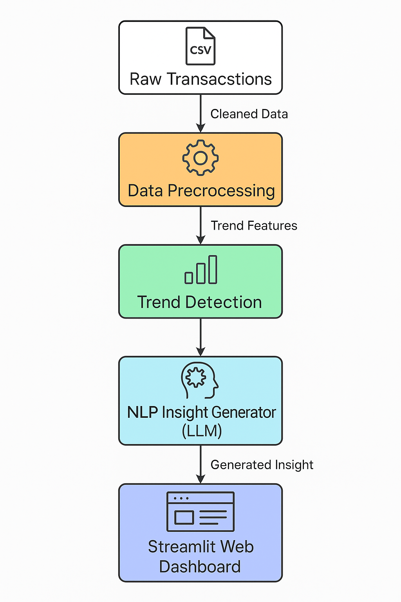

Smart Transaction Insights

Generate personalized, natural-language insights from your transaction data using machine learning and LLMs (like GPT-3.5). This tool analyzes spending patterns, highlights trends, and surfaces financial alerts in a human-readable format.

✨ Features

- 📊 Transaction trend analysis by category
- 🚨 Spending alerts for high-value purchases
- 🏆 Summary of top spending category
- 📉 Average monthly spend calculation
- 🤖 GPT-3.5 powered insight rephrasing (optional)
- 🖥️ Streamlit web dashboard for visualization

Architecture Diagrams

High-Level Overview

Low-Level Design

Tech Stack

- Python 3.9+
- pandas, numpy, matplotlib
- scikit-learn
- Streamlit (dashboard)
- openai (LLM via GPT-3.5)
- python-dotenv (secure API key loading)
